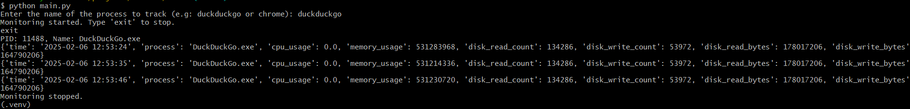

# ProcessPeeker

## Description
A basic python file built on the `psutil` module to track major info about process performance.
## Installation and Dependencies
Download the ProcessPeeker repository by entering the following commands into git.
```git
git clone https://github.com/JoeyRussoniello/ProcessPeeker
cd ProcessPeeker
```

*Note: This program is dependent on psutil module so the following command is needed to run:* ```pip install psutil```
## Usage
Once downloaded the main.py file can easily be called with ```python main.py```, taking user input to determine which process to track as pictured below

The process will then stay running, examining process performance every 5 seconds until "exit" or "e" is pressed. Results will be saved into `process_info.csv`
## Contribution
Contributions and Feedback are welcome! Submit a pull request at any time!
